# Guardian AI Chatbot
## AI-Powered Safety & Support Assistant

> Guardian AI is an AI-powered safety companion designed to provide conversational guidance, organized safety resources, personal safety insights, and structured reporting experiences through a modern mobile-first interface.

[](LICENSE)
[](#platform-support)
[](#ai-architecture)
[](#security-and-privacy)
[](#roadmap)


---

# Table of Contents

1. [Overview](#1-overview)
2. [Problem](#2-problem)
3. [Vision](#3-vision)
4. [Core Experience](#4-core-experience)
5. [Feature Architecture](#5-feature-architecture)
6. [Application Information Architecture](#6-application-information-architecture)
7. [System Architecture](#7-system-architecture)
8. [Client Architecture](#8-client-architecture)
9. [AI Architecture](#9-ai-architecture)
10. [Conversation Engine](#10-conversation-engine)
11. [Safety Intelligence Layer](#11-safety-intelligence-layer)
12. [Resources System](#12-resources-system)
13. [Reporting System](#13-reporting-system)
14. [Profile and Personalization](#14-profile-and-personalization)
15. [Data Architecture](#15-data-architecture)
16. [API Architecture](#16-api-architecture)
17. [Security and Privacy](#17-security-and-privacy)
18. [Threat Model](#18-threat-model)
19. [Error Handling and Resilience](#19-error-handling-and-resilience)
20. [Offline and Low-Connectivity Architecture](#20-offline-and-low-connectivity-architecture)
21. [User Experience Design](#21-user-experience-design)
22. [Accessibility](#22-accessibility)
23. [Performance Engineering](#23-performance-engineering)
24. [Testing Strategy](#24-testing-strategy)
25. [Observability](#25-observability)
26. [Development Workflow](#26-development-workflow)
27. [Environment Configuration](#27-environment-configuration)
28. [Local Development](#28-local-development)
29. [Production Deployment](#29-production-deployment)
30. [CI/CD](#30-cicd)
31. [Project Structure](#31-project-structure)
32. [Extensibility](#32-extensibility)
33. [Monetization Architecture](#33-monetization-architecture)
34. [Responsible AI](#34-responsible-ai)
35. [Roadmap](#35-roadmap)
36. [Hackathon / Demo Architecture](#36-hackathon--demo-architecture)
37. [Contribution Guide](#37-contribution-guide)
38. [Security Disclosure](#38-security-disclosure)
39. [License](#39-license)
40. [Conclusion](#40-conclusion)

---

# 1. Overview

Guardian AI is designed around a simple product principle:

> **Safety information should be easier to understand, easier to access, and easier to act on.**

Instead of presenting safety information as a collection of disconnected pages, Guardian AI can organize the experience around an intelligent conversational interface supported by structured resources, user context, reporting workflows, and safety-oriented application logic.

The public repository currently identifies the project as:

**Guardian AI Chatbot**

The repository also contains an application archive and visual assets corresponding to several major product surfaces:

* Home
* Profile
* Resources
* Report

These visible surfaces provide a useful foundation for understanding Guardian AI as a broader safety platform rather than a chatbot-only interface.

## Product Model

Guardian AI can be understood as five connected product layers:

```text
┌─────────────────────────────────────────────────────────────┐
│                         GUARDIAN AI                          │
├─────────────────────────────────────────────────────────────┤
│                                                             │
│  Conversational Interface                                  │
│  └── AI assistant for questions, guidance, and navigation   │
│                                                             │
│  Safety Intelligence                                        │
│  └── Context, classification, urgency, routing             │
│                                                             │
│  Resource Layer                                             │
│  └── Structured safety information                          │
│                                                             │
│  Reporting Layer                                            │
│  └── Structured incident / concern workflows                │
│                                                             │
│  Personalization                                            │
│  └── Profile, preferences, history, saved resources         │
│                                                             │
└─────────────────────────────────────────────────────────────┘
```

The architecture described in this README is intentionally modular so that Guardian AI can evolve from a prototype into a robust production platform without requiring a complete rewrite.

---

# 2. Problem

Modern safety information is fragmented.

A person looking for help may encounter:

* Search engines
* Government websites
* Local organization websites
* Emergency resources
* Community resources
* General-purpose chatbots
* Static informational pages
* Phone numbers
* PDFs
* Social platforms
* Maps
* Reporting portals

The challenge is not always a lack of information.

The challenge is that the information is frequently:

* Distributed across multiple systems
* Difficult to interpret
* Difficult to compare
* Difficult to access under stress
* Difficult to personalize
* Difficult to convert into an actionable next step

Guardian AI aims to provide a single intelligent interface through which a user can discover appropriate information and navigate toward useful resources.

---

# 3. Vision

The long-term vision is to transform Guardian AI from a chatbot into an intelligent safety operating layer.

The platform can evolve across four stages:

```text
Stage 1
Conversational Assistant
        │
        ▼
Stage 2
Context-Aware Safety Assistant
        │
        ▼
Stage 3
Personal Safety Intelligence Platform
        │
        ▼
Stage 4
Connected Safety Ecosystem
```

## Stage 1 — Conversational Assistant

Users can ask questions naturally.

Example categories:

```text
"What should I do if I feel unsafe?"

"Where can I find local support?"

"Can you explain this safety resource?"

"I need help understanding what this resource is for."
```

## Stage 2 — Context-Aware Assistant

The system can use non-sensitive contextual information such as:

* User preferences
* Selected region
* Resource categories
* Current application state
* User-provided context
* Previously viewed resources

## Stage 3 — Personal Safety Intelligence

The platform can introduce:

* Personalized resource recommendations
* Saved resources
* Safety checklists
* Structured reporting
* Risk-context summaries
* Intelligent conversation history
* Personalized notifications

## Stage 4 — Safety Ecosystem

Future integrations can include:

* Trusted resource databases
* Community organizations
* Location-aware public information
* Accessibility systems
* Emergency service information
* Institutional safety systems
* Verified third-party services

---

# 4. Core Experience

Guardian AI should feel like a calm, clear, approachable application.

The product experience should avoid overwhelming the user with excessive complexity.

A simplified experience can be represented as:

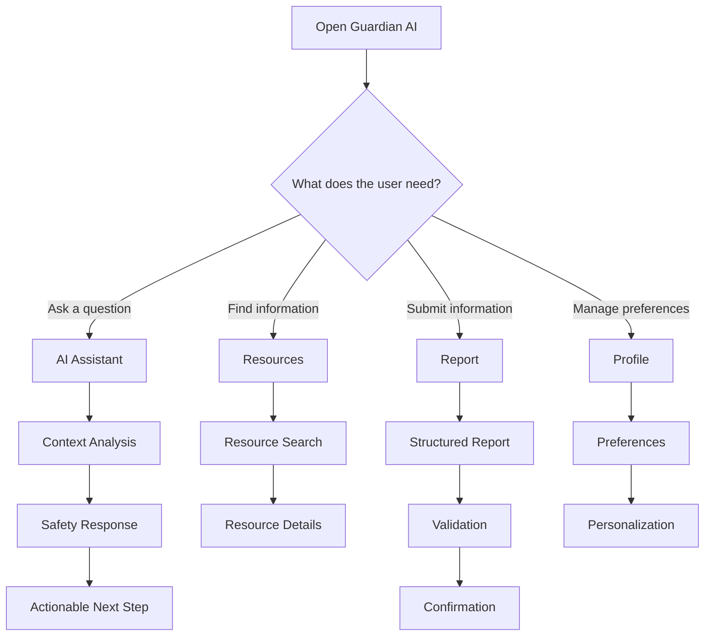

---

# 5. Feature Architecture

Guardian AI can be organized around six primary product domains.

## 5.1 AI Assistant

The AI assistant is the central conversational experience.

Responsibilities include:

* Natural language interaction
* Intent classification
* Context extraction
* Resource discovery
* Safety-oriented response generation
* Conversation state
* Response prioritization
* Escalation logic

## 5.2 Resources

The resource system provides structured information.

Potential resource types:

* Educational resources
* Support services
* Community organizations
* Safety guides
* Contact information
* Frequently asked questions
* Institution-specific resources

## 5.3 Reporting

The reporting system provides a structured form for submitting an issue, concern, or incident according to the product's intended use case.

A report should be:

* Explicitly user initiated
* Validated
* Clearly structured
* Reviewable before submission
* Securely transmitted
* Traceable through a status identifier

## 5.4 Profile

The profile system stores product preferences.

Potential preferences include:

* Display name
* Language
* Accessibility settings
* Notification preferences
* Saved resources
* Conversation preferences

Sensitive information should not be stored unless there is a clear product requirement and a documented privacy justification.

## 5.5 Safety Intelligence

The safety intelligence layer analyzes structured and conversational information to determine:

* Intent
* Urgency category
* Resource category
* Required response mode
* Whether additional context may be useful

## 5.6 Platform Services

Supporting services include:

* Authentication
* Storage
* API gateway
* Logging
* Analytics
* Configuration
* Notifications
* Error handling

---

# 6. Application Information Architecture

The visible product model can be represented through four major application surfaces.

```text
                    Guardian AI
                         │
       ┌─────────────────┼─────────────────┐
       │                 │                 │
       ▼                 ▼                 ▼
     HOME             RESOURCES         PROFILE
       │                 │                 │
       │                 │                 └── Preferences
       │                 │
       ▼                 ▼
    CHATBOT          Resource Catalog
       │
       ▼
  Safety Guidance

                         │
                         ▼
                       REPORT
                         │
                         ▼
                  Structured Workflow
```

## Home

The home screen should provide rapid access to:

* Assistant
* Key resources
* Reporting
* Personal settings
* Recently viewed or saved information

## Resources

The resources page should provide:

* Search
* Categories
* Resource cards
* Details
* Saved resources
* External links or contact methods where applicable

## Profile

The profile should provide:

* Account information
* Preferences
* Saved resources
* Privacy settings
* Accessibility
* Notification preferences

## Report

The report interface should support a controlled workflow:

```text
Start
  │
  ▼
Choose category
  │
  ▼
Provide details
  │
  ▼
Review
  │
  ▼
Submit
  │
  ▼
Confirmation
```

---

# 7. System Architecture

A production-ready Guardian AI architecture can be modeled as follows:

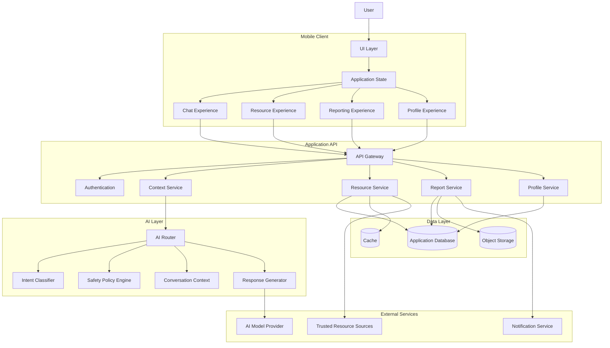

## Architectural Principle

The AI model should never become the application's entire business logic.

Instead:

```text
AI Model
   │
   ▼
Interpretation
   │
   ▼
Policy / Validation
   │
   ▼
Application Logic
   │
   ▼
User-Facing Result
```

This separation is especially important for safety-oriented applications.

---

# 8. Client Architecture

Guardian AI should use a layered client architecture.

```text
┌────────────────────────────┐
│ Presentation Layer         │
│                            │
│ Screens                    │
│ Components                 │
│ Navigation                 │
└──────────────┬─────────────┘
               │
┌──────────────▼─────────────┐
│ Application Layer          │
│                            │
│ Use Cases                  │
│ Controllers                │
│ State                      │
└──────────────┬─────────────┘
               │
┌──────────────▼─────────────┐
│ Domain Layer               │
│                            │
│ Safety Rules               │
│ Resource Models            │
│ Report Models              │
└──────────────┬─────────────┘
               │
┌──────────────▼─────────────┐
│ Infrastructure             │
│                            │
│ API                        │
│ Storage                    │
│ Notifications              │
│ AI Provider                │
└────────────────────────────┘
```

This architecture prevents UI components from directly implementing networking, persistence, and safety logic.

---

# 9. AI Architecture

The AI layer should be treated as a controlled reasoning subsystem.

A robust request lifecycle looks like this:

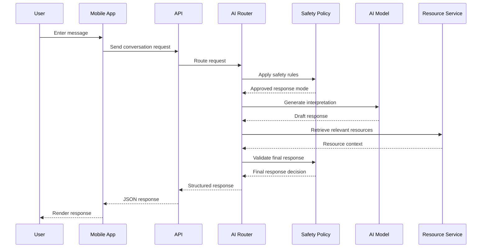

## AI Responsibilities

The AI layer can perform:

* Intent classification
* Semantic understanding
* Resource matching
* Conversational summarization
* Natural language generation
* Clarification generation
* User-facing explanation

## Non-AI Responsibilities

The application should retain deterministic control over:

* Authentication
* Authorization
* Data validation
* Report submission
* User permissions
* Audit records
* Security controls
* Resource metadata
* Notification dispatch

---

# 10. Conversation Engine

The conversation engine should model each message as a structured object rather than treating chat as raw text.

Example:

```json
{
  "conversationId": "conv_demo_001",
  "messageId": "msg_demo_001",
  "role": "user",
  "content": "I need help finding a safety resource.",
  "createdAt": "2026-09-16T12:00:00Z",
  "metadata": {
    "language": "en",
    "source": "mobile"
  }
}
```

An AI response can be represented as:

```json
{
  "conversationId": "conv_demo_001",
  "messageId": "msg_demo_002",
  "role": "assistant",
  "content": "I can help you find the right type of resource.",
  "createdAt": "2026-09-16T12:00:02Z",
  "metadata": {
    "intent": "resource_discovery",
    "confidence": 0.94
  }
}
```

## Conversation State

Conversation state can contain:

```text
Conversation
│
├── Metadata
├── Messages
├── Detected Intent
├── Selected Region
├── Resource Context
├── Safety Classification
├── User Preferences
└── Session Status
```

The AI should receive only the context necessary to answer the request.

---

# 11. Safety Intelligence Layer

The safety intelligence layer exists to prevent the language model from being the sole authority.

A conceptual pipeline:

```mermaid
flowchart LR
    A[Incoming Message]
    B[Input Validation]
    C[Intent Classification]
    D[Context Extraction]
    E[Safety Policy]
    F[Resource Retrieval]
    G[Response Generation]
    H[Response Validation]
    I[User Response]

    A --> B
    B --> C
    C --> D
    D --> E
    E --> F
    F --> G
    G --> H
    H --> I
```

## Classification Dimensions

A request can be classified along several dimensions:

### Intent

Examples:

* General information
* Resource search
* Resource explanation
* Reporting
* Profile support
* Account support

### Urgency

The product may use application-defined categories such as:

```text
NORMAL
ELEVATED
HIGH
CRITICAL
```

These are product states rather than medical or legal diagnoses.

### Output Mode

Possible output modes:

```text
INFORMATIONAL
RESOURCE_NAVIGATION
CLARIFICATION
SAFETY_REDIRECT
REPORT_WORKFLOW
```

---

# 12. Resources System

The resources system transforms static information into searchable application data.

## Resource Model

Example resource:

```json
{
  "id": "resource_001",
  "title": "Community Support Service",
  "description": "Example support resource description.",
  "category": "support",
  "region": "CA",
  "verified": true,
  "contact": {
    "phone": "+1-000-000-0000",
    "website": "https://example.org"
  },
  "tags": [
    "support",
    "community"
  ]
}
```

## Resource Lifecycle

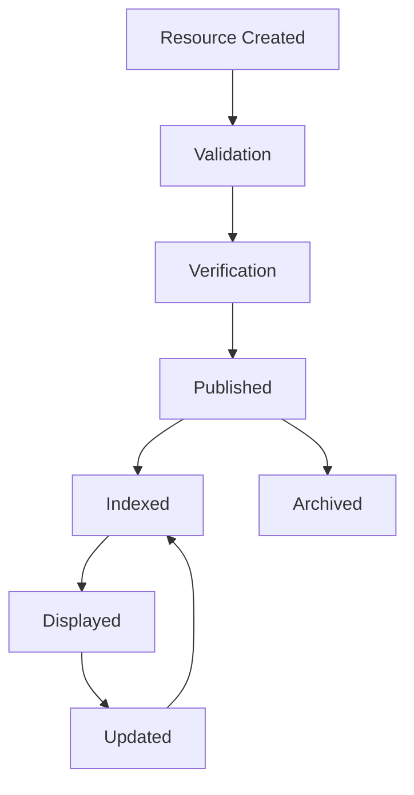

## Search Architecture

A scalable implementation can combine:

* Exact text search
* Category filters
* Region filters
* Semantic search
* Ranking
* Verification state
* Freshness

Example:

```text
User Query
    │
    ├── Keyword Search
    │
    ├── Semantic Retrieval
    │
    ├── Category Filter
    │
    ├── Region Filter
    │
    └── Verification Filter
            │
            ▼
      Ranked Resources
```

---

# 13. Reporting System

The reporting workflow should be deterministic.

The AI can assist users in understanding the form, but it should not silently submit anything.

## Reporting Flow

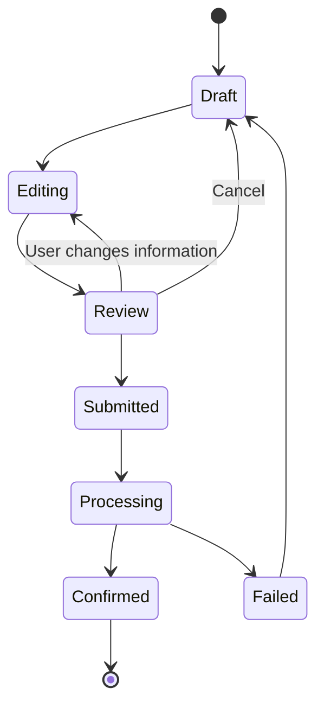

## Report Object

Example:

```json
{
  "reportId": "report_demo_001",
  "status": "draft",
  "category": "general_concern",
  "summary": "Example user-provided information.",
  "details": "Example structured details.",
  "createdAt": "2026-09-16T12:00:00Z"
}
```

## Important Product Principle

The user should always know:

* What information is being submitted
* Who receives it
* Whether submission is complete
* What happens next

There should be no hidden submission.

---

# 14. Profile and Personalization

The profile layer should support personalization without collecting unnecessary information.

## Profile Architecture

```text
Profile
│
├── Identity
│   ├── Display Name
│   └── Account Identifier
│
├── Preferences
│   ├── Language
│   ├── Notifications
│   └── Accessibility
│
├── Saved Content
│   ├── Resources
│   └── Conversations
│
└── Privacy
    ├── Data Controls
    ├── Export
    └── Delete
```

## Personalization Philosophy

Personalization should improve:

* Relevance
* Accessibility
* Discoverability
* Convenience

It should not be used to make unsupported assumptions about the user.

---

# 15. Data Architecture

A production backend can use a relational database for structured state.

Conceptual schema:

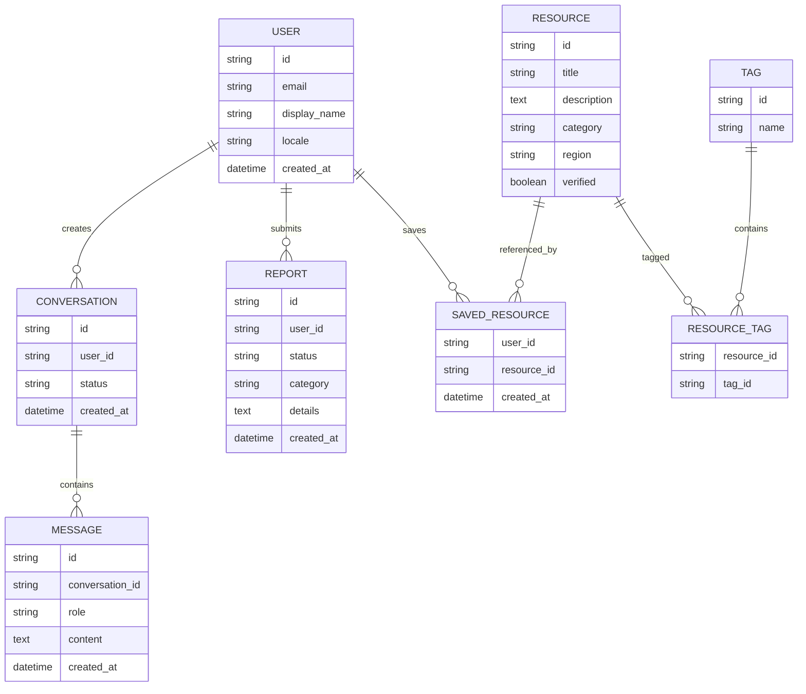

---

# 16. API Architecture

Guardian AI should expose a versioned API.

Recommended prefix:

```text
/api/v1
```

## Example Endpoint Groups

### Authentication

```text
POST /api/v1/auth/session
POST /api/v1/auth/logout
GET  /api/v1/auth/me
```

### Conversations

```text
POST /api/v1/conversations
GET  /api/v1/conversations
GET  /api/v1/conversations/:id
POST /api/v1/conversations/:id/messages
DELETE /api/v1/conversations/:id
```

### Resources

```text
GET  /api/v1/resources
GET  /api/v1/resources/:id
GET  /api/v1/resources/search
POST /api/v1/resources/:id/save
DELETE /api/v1/resources/:id/save
```

### Reports

```text
POST /api/v1/reports
GET  /api/v1/reports
GET  /api/v1/reports/:id
PATCH /api/v1/reports/:id
```

### Profile

```text
GET   /api/v1/profile
PATCH /api/v1/profile
GET   /api/v1/profile/preferences
PATCH /api/v1/profile/preferences
```

---

# 17. API Request Flow

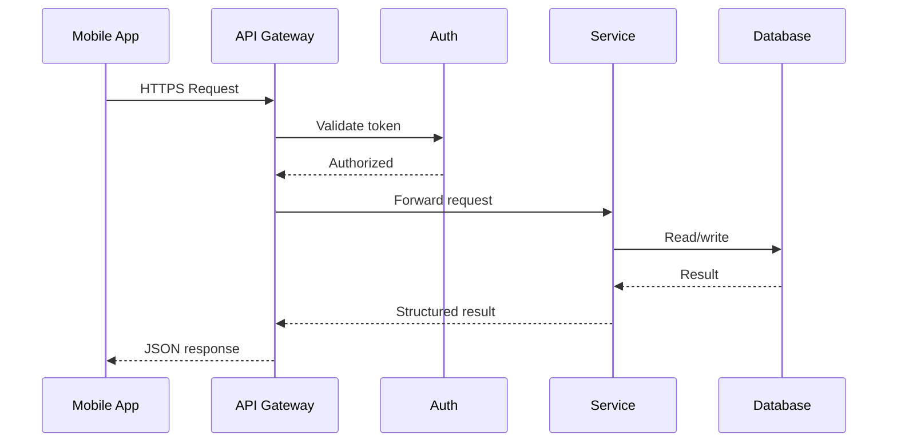

## API Response Format

A consistent structure makes client development easier:

```json
{
  "success": true,
  "data": {},
  "error": null,
  "requestId": "req_001"
}
```

Error example:

```json
{
  "success": false,
  "data": null,
  "error": {
    "code": "RESOURCE_NOT_FOUND",
    "message": "The requested resource was not found."
  },
  "requestId": "req_002"
}
```

---

# 18. Security and Privacy

Guardian AI should use a privacy-first security model.

## Security Principles

1. Minimize collected data.
2. Encrypt data in transit.
3. Encrypt sensitive data at rest.
4. Never expose secrets in the client.
5. Validate every API request.
6. Separate authentication from authorization.
7. Log security events without logging unnecessary sensitive content.
8. Provide data deletion mechanisms.
9. Protect administrative endpoints separately.
10. Treat AI output as untrusted application input.

## Data Flow

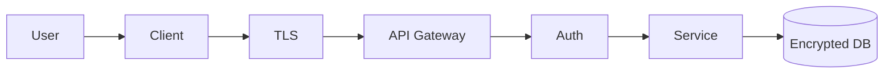

---

# 19. Threat Model

A safety application should explicitly consider common threats.

## Threat Categories

### Credential Theft

Potential mitigation:

* Secure authentication
* Short-lived access tokens
* Refresh-token rotation
* Secure storage
* Session revocation

### API Abuse

Mitigation:

* Rate limiting
* Request validation
* Abuse detection
* Per-account quotas
* Server-side authorization

### Prompt Injection

AI systems can receive adversarial text.

A layered approach:

```text
User Input
   │
   ▼
Sanitization
   │
   ▼
Context Separation
   │
   ▼
Policy Enforcement
   │
   ▼
AI Model
   │
   ▼
Output Validation
```

### Data Leakage

Mitigation:

* Data minimization
* Access controls
* Encryption
* Redaction
* Secure logs

---

# 20. Error Handling and Resilience

A reliable mobile app must assume that failures will occur.

Potential failure classes:

```text
NETWORK_FAILURE
AUTH_FAILURE
RATE_LIMIT
SERVER_ERROR
AI_PROVIDER_ERROR
RESOURCE_UNAVAILABLE
TIMEOUT
INVALID_RESPONSE
LOCAL_STORAGE_ERROR
```

## Retry Strategy

Not every operation should be retried.

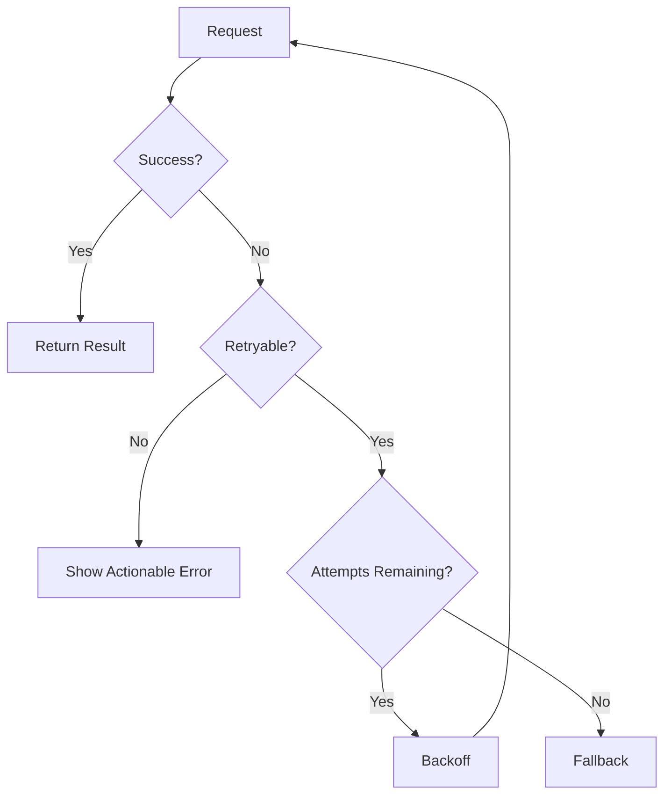

## Exponential Backoff

A typical policy:

```text
Attempt 1: 250 ms
Attempt 2: 500 ms
Attempt 3: 1000 ms
Attempt 4: 2000 ms
```

Jitter should be introduced in production to avoid synchronized retries.

---

# 21. AI Failure Handling

AI providers can fail independently from the rest of the platform.

The system should therefore use provider abstraction.

```text
AI Gateway
│
├── Primary Provider
│
├── Secondary Provider
│
└── Deterministic Fallback
```

Example:

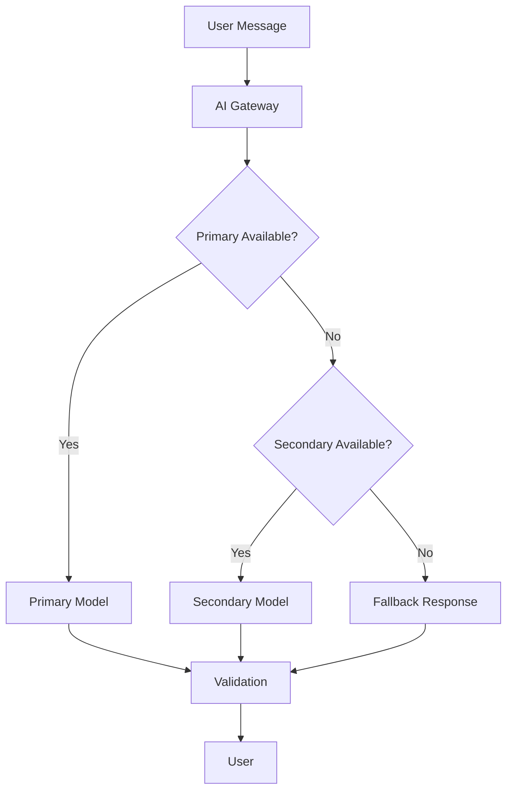

The fallback should avoid pretending that an unavailable AI system produced an answer.

---

# 22. Offline and Low-Connectivity Architecture

Mobile users may have unreliable connectivity.

Guardian AI can support a degraded mode.

Potential offline capabilities:

* Cached resource categories
* Previously viewed resources
* Local profile preferences
* Draft report forms
* Draft conversation state
* Offline UI navigation

Offline queue:

```text
User Action
    │
    ▼
Local Queue
    │
    ▼
Network Available?
   / \
 No   Yes
 |     |
Store  Send
 |     |
 └──► Sync
```

The app should clearly distinguish:

```text
Saved locally
```

from:

```text
Successfully submitted
```

---

# 23. User Experience Design

Guardian AI should be optimized for clarity rather than visual complexity.

## Design Principles

### Calm

Avoid unnecessary visual noise.

### Direct

Important actions should be obvious.

### Predictable

Navigation should remain consistent.

### Transparent

The system should explain important actions.

### Accessible

Information should remain usable with different interaction needs.

## Primary Navigation

A conceptual bottom navigation:

```text
┌────────┬────────────┬───────────┬────────┐
│  Home  │ Resources  │  Report   │ Profile│
└────────┴────────────┴───────────┴────────┘
```

The AI assistant can remain the primary home interaction.

---

# 24. Chat UX

The chatbot should support:

* Clear message hierarchy
* User/assistant distinction
* Loading state
* Retry behavior
* Copy action
* Resource cards
* Suggested follow-up actions
* Report navigation
* Safe interruption handling

Example:

```text
┌─────────────────────────────────────────────┐
│ Guardian AI                                 │
├─────────────────────────────────────────────┤
│                                             │
│  How can I help?                            │
│                                             │
│  ┌─────────────────────────────────────┐    │
│  │ Find a resource near me             │    │
│  └─────────────────────────────────────┘    │
│                                             │
│  ┌─────────────────────────────────────┐    │
│  │ Explain a safety resource            │    │
│  └─────────────────────────────────────┘    │
│                                             │
│  ─────────────────────────────────────────  │
│                                             │
│  [ Type a message...                  ]     │
│                              [Send]         │
└─────────────────────────────────────────────┘
```

---

# 25. Accessibility

Accessibility should be treated as a platform feature.

## Requirements

Recommended baseline:

* Semantic labels
* Dynamic text sizing
* Sufficient contrast
* Screen-reader compatibility
* Large touch targets
* Keyboard navigation where relevant
* Reduced-motion support
* Accessible error messages
* Non-color-only status indicators

## Status Example

Do not rely on color alone:

```text
✓ Verified
! Needs Review
× Unavailable
```

---

# 26. Performance Engineering

Performance matters particularly on mobile devices.

## Performance Targets

The application should aim for:

* Fast initial render
* Minimal blocking JavaScript
* Efficient list rendering
* Image optimization
* Lazy loading
* Cached resources
* Debounced search
* Batched network calls

## Performance Pipeline

```text
App Start
   │
   ▼
Critical UI
   │
   ▼
Navigation
   │
   ▼
Async Data
   │
   ├── Resources
   ├── Profile
   └── Conversation
```

Non-critical data should not block the first meaningful screen.

---

# 27. Resource Search Performance

For large resource catalogs:

```text
Search Input
    │
    ▼
Debounce 250–400ms
    │
    ▼
Normalized Query
    │
    ▼
Cache Check
    │
    ├── Hit ───────► Return Cached Result
    │
    └── Miss
         │
         ▼
      API Search
         │
         ▼
      Cache Result
         │
         ▼
      Render List
```

Pagination should be preferred over returning an unnecessarily large resource payload.

---

# 28. Testing Strategy

Guardian AI requires multiple layers of testing.

## Unit Tests

Test:

* Classification logic
* Validation
* Data models
* Utility functions
* API parsing
* State reducers
* Resource filtering

## Integration Tests

Test:

* Login
* Conversation flow
* Resource search
* Report creation
* Profile editing

## End-to-End Tests

Test complete user workflows.

Example:

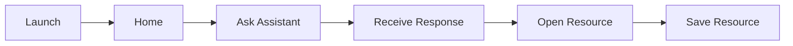

---

# 29. AI Evaluation

Traditional UI tests are insufficient for AI features.

Guardian AI should maintain an evaluation dataset.

Example:

```json
{
  "id": "eval_001",
  "input": "example input",
  "expectedIntent": "resource_discovery",
  "expectedOutputMode": "RESOURCE_NAVIGATION"
}
```

Metrics can include:

* Intent classification accuracy
* Resource retrieval precision
* Resource retrieval recall
* Policy compliance
* Hallucination rate
* Response latency
* Failure rate

---

# 30. Observability

Production systems should provide useful signals.

## Application Metrics

```text
app_startup_time
screen_render_time
api_latency
api_error_rate
resource_search_latency
report_submission_rate
conversation_latency
ai_provider_failure_rate
```

## AI Metrics

```text
requests
tokens
latency
fallback_rate
classification_confidence
validation_failures
```

Sensitive content should not be indiscriminately written to logs.

---

# 31. Logging Architecture

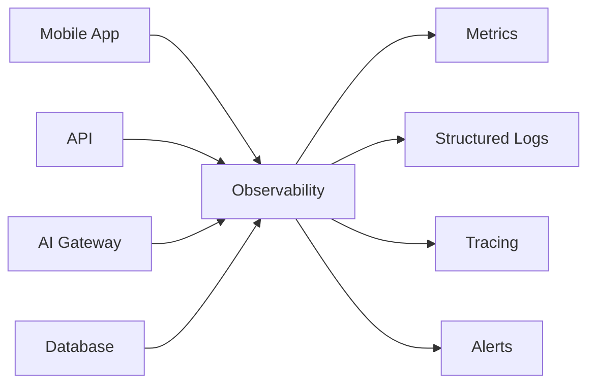

Use structured logs:

```json
{
  "timestamp": "2026-09-16T12:00:00Z",
  "level": "info",
  "service": "resource-service",
  "event": "resource_search",
  "requestId": "req_001",
  "durationMs": 142
}
```

---

# 32. Development Workflow

A healthy development workflow:

```text
Issue
  │
  ▼
Design
  │
  ▼
Implementation
  │
  ▼
Unit Tests
  │
  ▼
Integration Tests
  │
  ▼
Security Review
  │
  ▼
Pull Request
  │
  ▼
CI
  │
  ▼
Review
  │
  ▼
Merge
```

## Branching Strategy

Recommended:

```text
main
│
├── feature/*
├── fix/*
├── refactor/*
└── chore/*
```

Commit examples:

```text
feat: add resource search
fix: handle report submission timeout
refactor: isolate AI gateway
test: add conversation integration coverage
docs: expand architecture documentation
```

---

# 33. Environment Configuration

Secrets should never be committed.

Example `.env` model:

```env
APP_ENV=development

API_BASE_URL=https://api.example.com

AI_PROVIDER=example
AI_API_KEY=replace_me

DATABASE_URL=replace_me

ANALYTICS_ENABLED=false

NOTIFICATIONS_ENABLED=false
```

A better architecture separates public configuration from secrets.

```text
Public Config
   │
   ├── API URL
   ├── Feature flags
   └── UI settings

Secret Config
   │
   ├── AI API keys
   ├── Database credentials
   ├── Signing secrets
   └── Notification credentials
```

---

# 34. Local Development

## Prerequisites

Install:

* Git
* Your project's mobile SDK/toolchain
* Node.js or the appropriate runtime
* Package manager
* Platform build tools

## Clone

```bash
git clone https://github.com/lucylow/GuardianAI.git
cd GuardianAI
```

## Install Dependencies

Use the dependency manager appropriate to the checked-out application.

For example:

```bash
npm install
```

or:

```bash
yarn install
```

or:

```bash
pnpm install
```

## Run

```bash
npm run dev
```

The exact command should follow the scripts defined by the application package configuration.

---

# 35. Project Structure

A scalable Guardian AI project can use:

```text
GuardianAI/
│
├── app/
│   ├── screens/
│   │   ├── Home/
│   │   ├── Resources/
│   │   ├── Report/
│   │   └── Profile/
│   │
│   ├── components/
│   │   ├── chat/
│   │   ├── resources/
│   │   ├── reports/
│   │   └── common/
│   │
│   ├── navigation/
│   │
│   └── hooks/
│
├── domain/
│   ├── conversation/
│   ├── resource/
│   ├── report/
│   ├── profile/
│   └── safety/
│
├── services/
│   ├── api/
│   ├── ai/
│   ├── auth/
│   ├── storage/
│   └── notifications/
│
├── state/
│
├── assets/
│
├── tests/
│
├── docs/
│
├── scripts/
│
└── README.md
```

The exact production folder structure should follow the implementation language and framework used by the application.

---

# 36. Dependency Boundaries

Avoid allowing every package to import every other package.

Preferred dependency direction:

```text
UI
 │
 ▼
Application
 │
 ▼
Domain
 │
 ▼
Infrastructure
```

Avoid:

```text
UI ───────► Database
UI ───────► AI Provider
UI ───────► Authentication Secrets
```

Instead:

```text
UI
 │
 ▼
Application Service
 │
 ├── Domain
 └── Infrastructure Adapter
```

---

# 37. AI Provider Abstraction

The AI layer should be provider independent.

```typescript
export interface AIProvider {
  generate(input: AIRequest): Promise<AIResponse>;
  classify(input: ClassificationRequest): Promise<ClassificationResult>;
}
```

Implementations can then be swapped:

```text
AIProvider
   │
   ├── ProviderA
   ├── ProviderB
   ├── LocalProvider
   └── MockProvider
```

This provides:

* Easier testing
* Lower coupling
* Provider fallback
* Cost optimization
* Environment-specific behavior

---

# 38. Mock Mode

A mock AI provider is useful for development and demos.

```typescript
export class MockAIProvider implements AIProvider {
  async generate(input: AIRequest): Promise<AIResponse> {
    return {
      content: "This is a simulated Guardian AI response.",
      metadata: {
        provider: "mock"
      }
    };
  }

  async classify(): Promise<ClassificationResult> {
    return {
      intent: "resource_discovery",
      confidence: 0.91
    };
  }
}
```

This allows UI work to continue when production API credentials are unavailable.

---

# 39. Feature Flags

Feature flags can help ship functionality safely.

Example:

```json
{
  "aiAssistant": true,
  "resourceSearch": true,
  "reporting": true,
  "profile": true,
  "offlineMode": false,
  "semanticSearch": false,
  "advancedPersonalization": false
}
```

Feature flags should be validated server-side for sensitive capabilities.

---

# 40. API Security Model

Every private API endpoint should verify:

```text
Authentication
       │
       ▼
Identity
       │
       ▼
Authorization
       │
       ▼
Resource Ownership
       │
       ▼
Validation
```

Example:

```text
GET /reports/report_123
```

The server should not merely check:

```text
Is the user logged in?
```

It should verify:

```text
Is the user authorized to access this report?
```

---

# 41. Data Ownership

Every user-owned object should have an explicit owner relationship.

Example:

```text
User
 │
 ├── Conversations
 ├── Reports
 ├── Saved Resources
 └── Preferences
```

The API should enforce ownership at the service layer.

---

# 42. Resource Verification

Safety resource data should include verification metadata.

Example:

```json
{
  "verified": true,
  "verifiedAt": "2026-09-01T00:00:00Z",
  "sourceType": "official",
  "lastReviewedAt": "2026-09-15T00:00:00Z"
}
```

A resource can then be displayed with appropriate transparency.

Example:

```text
Community Resource

Description...

Verified
Last reviewed: recent
```

The UI should not imply that a resource is official unless that status has actually been established.

---

# 43. Content Moderation

The platform should implement multiple layers of content moderation.

```text
Input
 │
 ▼
Content Safety Filter
 │
 ▼
Intent Classification
 │
 ▼
Application Policy
 │
 ▼
AI Generation
 │
 ▼
Output Validation
 │
 ▼
User
```

For especially sensitive workflows, deterministic application logic should take precedence over generated text.

---

# 44. Prompt Architecture

Prompts should be versioned.

Example:

```text
prompts/
├── assistant_v1.txt
├── assistant_v2.txt
├── resource_summary_v1.txt
└── classification_v1.txt
```

Each AI request should identify:

```json
{
  "promptVersion": "assistant_v2",
  "model": "configured-model"
}
```

This improves reproducibility and evaluation.

---

# 45. AI Context Window Management

Long conversations should not blindly send the entire history on every request.

Use:

```text
Recent Messages
      +
Conversation Summary
      +
Relevant Resources
      +
Current User Intent
      +
Safety Context
```

Example:

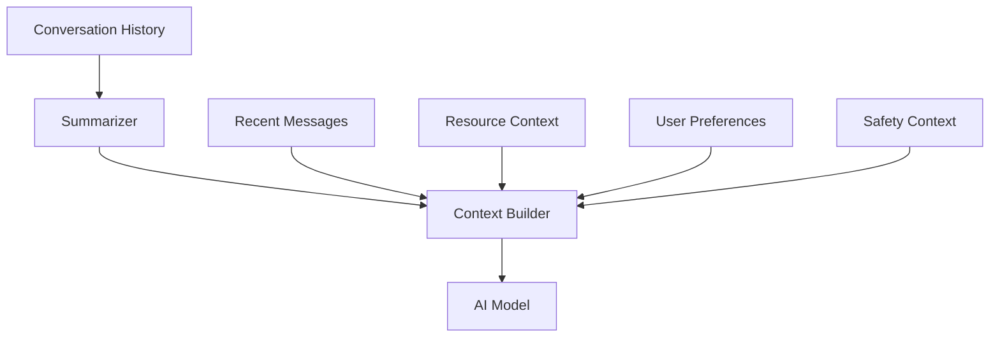

This reduces unnecessary token usage.

---

# 46. Caching Strategy

Caching can improve:

* Resource search
* Static content
* Profile configuration
* Feature configuration

Avoid caching highly dynamic or sensitive user state without careful controls.

Potential layers:

```text
Client Cache
      │
      ▼
API Cache
      │
      ▼
Database
```

Cache keys should include relevant dimensions:

```text
resource-search:{region}:{category}:{query}:{page}
```

---

# 47. Notification Architecture

A future notification system can be modeled as:

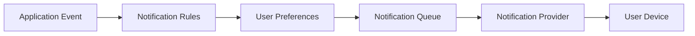

Notification categories should remain explicit and user-controllable.

---

# 48. Analytics Architecture

Analytics should focus on product behavior rather than collecting unnecessary content.

Useful events:

```text
screen_view
resource_search
resource_open
resource_save
conversation_started
conversation_completed
report_started
report_submitted
error_shown
```

Avoid logging full sensitive conversation text as analytics events.

Example:

```json
{
  "event": "resource_open",
  "resourceId": "resource_001",
  "category": "support",
  "timestamp": "2026-09-16T12:00:00Z"
}
```

---

# 49. Monetization Architecture

Guardian AI can support a sustainable business model without compromising core safety functionality.

Potential models include:

## Free Tier

```text
Basic AI conversations
Resource search
Core safety information
Basic profile
```

## Premium Tier

Potential enhancements:

```text
Expanded personalization
Advanced organization
Enhanced history
Additional convenience features
Priority product features
```

Any monetization feature should remain clearly separated from essential safety functionality.

---

# 50. Subscription Architecture

A subscription model could use:

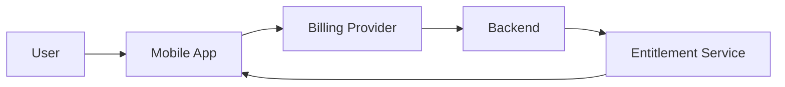

The client should never be the final authority for paid entitlements.

---

# 51. Responsible AI

Guardian AI should follow a responsible AI framework.

## Principle 1 — Transparency

Users should understand when they are interacting with AI.

## Principle 2 — Uncertainty

AI should not present guesses as verified facts.

## Principle 3 — Human Agency

The system should support user decision-making rather than pretending to replace trusted professionals or institutions.

## Principle 4 — Privacy

Only necessary information should be processed.

## Principle 5 — Safety

The product should provide clear paths to appropriate external resources when the application determines that additional help may be needed.

---

# 52. AI Output Contract

A structured response contract is safer than returning raw model text.

Example:

```json
{
  "type": "assistant_response",
  "content": "Example response.",
  "intent": "resource_discovery",
  "actions": [
    {
      "type": "open_resource",
      "resourceId": "resource_001"
    }
  ],
  "disclaimer": null
}
```

The UI can then safely render:

```text
Response
+
Action
+
Resource
+
Optional Notice
```

instead of interpreting arbitrary model-generated markup.

---

# 53. Structured Actions

AI actions should use an allowlist.

```typescript
type AllowedAction =
  | {
      type: "open_resource";
      resourceId: string;
    }
  | {
      type: "open_report";
    }
  | {
      type: "open_profile";
    };
```

Avoid letting the model directly execute arbitrary system commands.

---

# 54. State Machine for the Assistant

A conversation can be modeled with application states:

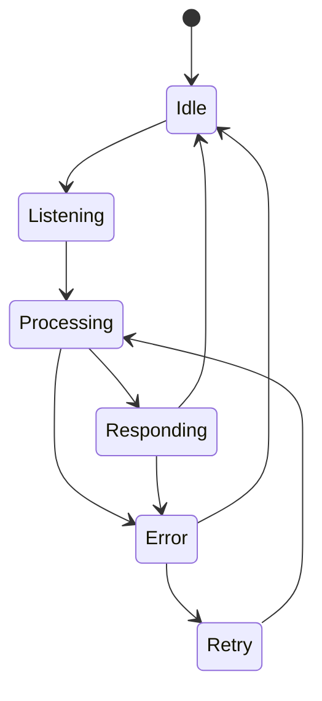

This creates predictable UI behavior.

---

# 55. Loading States

The product should explicitly distinguish:

```text
Loading
Processing
Waiting for network
Unavailable
Retrying
Completed
```

Example:

```text
Guardian AI
──────────────

Thinking…

[Cancel]
```

Avoid displaying an indefinite spinner.

---

# 56. Empty States

Every major screen should have an intentional empty state.

Resources:

```text
No saved resources yet.

Browse resources to build your personal list.
```

Reports:

```text
No reports yet.

Reports you create will appear here.
```

Conversations:

```text
No conversations yet.

Start a conversation with Guardian AI.
```

---

# 57. Navigation Architecture

A centralized navigation configuration prevents inconsistent routes.

```text
Root
│
├── Home
│   └── Chat
│
├── Resources
│   ├── Search
│   └── Details
│
├── Report
│   ├── Create
│   ├── Review
│   └── Confirmation
│
└── Profile
    ├── Settings
    ├── Saved
    └── Privacy
```

---

# 58. State Management

The app should separate:

### Server State

* Resources
* Reports
* Conversations from backend

### Client State

* Current navigation
* Modal visibility
* Form state
* Loading state

### Persistent State

* Preferences
* Session information
* Saved configuration

Example:

```text
Server State
     │
     ▼
Query Cache
     │
     ▼
UI

Local State ─────────► UI
```

---

# 59. Form Validation

Reporting forms should validate:

* Required fields
* Character limits
* Supported categories
* Formatting
* Missing data

Example:

```typescript
const errors = validateReport(input);

if (errors.length > 0) {
  return {
    valid: false,
    errors
  };
}
```

The same rules should also be implemented server-side.

---

# 60. Idempotency

Report submission should be protected against accidental duplicate submissions.

Client:

```text
Submit
  │
  ▼
Request ID
  │
  ▼
Server
  │
  ▼
Create once
```

Example:

```http
Idempotency-Key: report-submit-unique-id
```

The server can use the key to prevent duplicate records.

---

# 61. Background Synchronization

For future offline support:

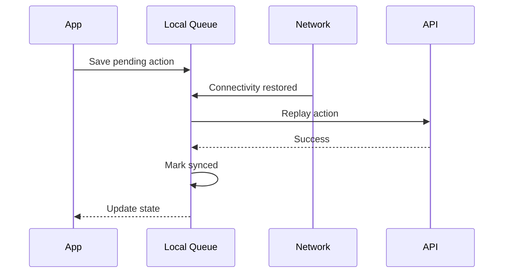

---

# 62. Security Testing

Security testing should include:

```text
Authentication tests
Authorization tests
Input validation tests
Rate-limit tests
Session tests
Secret scanning
Dependency scanning
API fuzzing
Prompt injection tests
Data access tests
```

A security review should be performed before handling real sensitive information.

---

# 63. Dependency Security

Recommended pipeline:

```text
Pull Request
     │
     ▼
Dependency Audit
     │
     ▼
Secret Scan
     │
     ▼
Static Analysis
     │
     ▼
Tests
     │
     ▼
Build
```

Dependencies should be updated regularly.

---

# 64. CI/CD Architecture

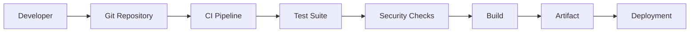

Recommended CI stages:

1. Install dependencies
2. Lint
3. Type check
4. Unit tests
5. Integration tests
6. Security checks
7. Build
8. Artifact validation

---

# 65. Deployment Environments

Use separate environments:

```text
Development
     │
     ▼
Staging
     │
     ▼
Production
```

Each environment should have separate:

* API credentials
* Databases
* Storage
* AI configuration
* Analytics
* Notification credentials

---

# 66. Production Readiness Checklist

Before production:

```text
[ ] Authentication configured
[ ] Authorization verified
[ ] API rate limiting enabled
[ ] Secrets stored securely
[ ] Database backups enabled
[ ] Error tracking configured
[ ] AI provider fallback configured
[ ] Resource verification workflow established
[ ] Report permissions reviewed
[ ] Privacy policy published
[ ] Data deletion implemented
[ ] Accessibility tested
[ ] Performance tested
[ ] Mobile builds tested
[ ] Crash reporting configured
```

---

# 67. Disaster Recovery

A production system should have a recovery strategy.

```text
Primary Database
      │
      ▼
Automated Backups
      │
      ▼
Recovery Storage
```

Recovery planning should define:

* Recovery Point Objective
* Recovery Time Objective
* Backup frequency
* Restore testing
* Key rotation procedures
* Incident communication

---

# 68. Incident Response

Security incidents should follow a defined process:

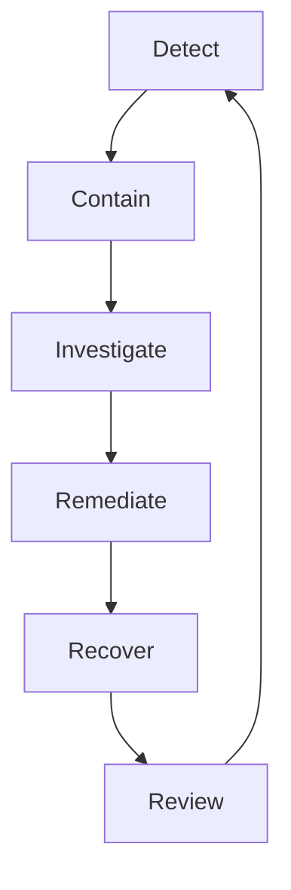

The process should be documented before a major incident occurs.

---

# 69. Documentation Strategy

Guardian AI documentation should eventually be split into:

```text
docs/
├── architecture/
├── api/
├── ai/
├── security/
├── product/
├── deployment/
├── testing/
└── contributing/
```

Recommended documents:

```text
ARCHITECTURE.md
API.md
AI_ARCHITECTURE.md
SECURITY.md
PRIVACY.md
DEPLOYMENT.md
TESTING.md
CONTRIBUTING.md
```

---

# 70. Technical Documentation Principles

Every major subsystem should document:

* Purpose
* Inputs
* Outputs
* Dependencies
* Security assumptions
* Failure modes
* Testing strategy

Example:

```text
Feature: Resource Search

Purpose:
Find relevant safety resources.

Inputs:
Query, category, region.

Outputs:
Ranked resources.

Dependencies:
Resource service, search index.

Failure Mode:
Return cached results or error state.

Security:
No unauthorized private resources.
```

---

# 71. Future Semantic Search

Guardian AI can evolve from keyword search to semantic retrieval.

Architecture:

```mermaid
flowchart TD
    Q[User Query]
    E[Embedding Generator]
    V[(Vector Index)]
    R[Retriever]
    RR[Ranker]
    UI[Resource Results]

    Q --> E
    E --> R
    R --> V
    V --> R
    R --> RR
    RR --> UI
```

This could allow conceptually similar requests to retrieve useful resources even when exact wording differs.

---

# 72. Retrieval-Augmented Generation

A future AI architecture can use RAG:

```text
User Question
     │
     ▼
Query Understanding
     │
     ▼
Resource Retrieval
     │
     ▼
Relevant Context
     │
     ▼
AI Response
     │
     ▼
Output Validation
```

The key principle is that generated explanations should be grounded in approved application data wherever factual resource information is involved.

---

# 73. Resource Freshness

Resources can include freshness metadata:

```json
{
  "lastReviewedAt": "2026-09-15T00:00:00Z",
  "reviewStatus": "verified",
  "sourceType": "trusted"
}
```

The UI can then prioritize recently reviewed resources.

Potential lifecycle:

```text
Fresh
  │
  ▼
Review Due
  │
  ▼
Under Review
  │
  ├── Verified
  │     │
  │     └── Fresh
  │
  └── Archived
```

---

# 74. Personal Safety Dashboard

A future dashboard could summarize:

```text
Guardian AI
────────────────────────

Quick Actions

[ Ask Guardian AI ]

[ Find Resources ]

[ Start a Report ]

────────────────────────

Saved Resources

2 resources saved

────────────────────────

Recent Activity

Conversation
Resource viewed
Report draft
```

The dashboard should prioritize useful actions rather than unnecessary statistics.

---

# 75. Intelligent Recommendations

Recommendations can combine:

```text
Current Intent
+
Selected Region
+
Resource Category
+
Saved Resources
+
Recent Activity
```

A recommendation engine should remain explainable.

Example:

```text
Recommended because:
You were browsing community support resources.
```

This is preferable to unexplained recommendations.

---

# 76. Guardian AI as an AI Gateway

The application can eventually expose an internal AI gateway:

```text
Mobile Client
      │
      ▼
Guardian AI Gateway
      │
      ├── Intent
      ├── Safety Policy
      ├── Retrieval
      ├── Provider Routing
      ├── Budgeting
      └── Logging
             │
             ▼
        AI Provider(s)
```

Advantages:

* Centralized policy
* Easier model switching
* Cost control
* Better observability
* Prompt versioning
* Provider fallback

---

# 77. Cost Controls

AI requests should have budgets.

Example:

```text
Request
  │
  ▼
Estimate Cost
  │
  ▼
Budget Available?
 / \
No  Yes
|    |
Fallback  AI
```

Potential controls:

```text
Maximum tokens
Maximum request count
Per-user quotas
Provider routing
Caching
Summarization
```

---

# 78. Mobile Performance Strategy

The application should avoid unnecessarily large payloads.

Instead of:

```json
{
  "resources": [
    "... thousands of records ..."
  ]
}
```

Prefer:

```json
{
  "items": [],
  "page": 1,
  "pageSize": 20,
  "hasNextPage": true
}
```

This improves memory usage and rendering performance.

---

# 79. Image and Asset Optimization

For application assets:

* Compress large images
* Prefer modern formats where supported
* Avoid loading unnecessary screenshots
* Lazy-load non-critical assets
* Use correct dimensions
* Avoid duplicate assets

The repository currently includes several app screenshots as visual assets, so asset management should remain organized as the project grows.

---

# 80. Design System

Guardian AI should eventually centralize:

```text
Colors
Typography
Spacing
Radius
Shadows
Icons
Buttons
Inputs
Cards
Dialogs
Navigation
```

Example token structure:

```json
{
  "spacing": {
    "xs": 4,
    "sm": 8,
    "md": 16,
    "lg": 24,
    "xl": 32
  },
  "radius": {
    "sm": 8,
    "md": 12,
    "lg": 20
  }
}
```

---

# 81. Component Architecture

Reusable components may include:

```text
GuardianButton
GuardianCard
GuardianInput
GuardianHeader
GuardianMessage
ResourceCard
ResourceList
ReportForm
ReportStatus
ProfileRow
LoadingState
ErrorState
EmptyState
```

This reduces duplicated styling and improves consistency.

---

# 82. Mobile UI State Model

Every asynchronous screen should define:

```text
Initial
Loading
Success
Empty
Error
Refreshing
Retrying
```

For resources:

```mermaid
stateDiagram-v2
    [*] --> Initial
    Initial --> Loading
    Loading --> Success
    Loading --> Empty
    Loading --> Error
    Success --> Refreshing
    Refreshing --> Success
    Refreshing --> Error
    Error --> Loading
```

---

# 83. API Contract Testing

Client and server teams should agree on schemas.

Example:

```text
OpenAPI
   │
   ▼
Generated Types
   │
   ├── Mobile Client
   └── Server
```

This decreases mismatches such as:

```text
Frontend expects:
resource.name

Backend returns:
resource.title
```

---

# 84. Example OpenAPI Concept

```yaml
openapi: 3.0.3

paths:
  /api/v1/resources:
    get:
      summary: List resources
      parameters:
        - in: query
          name: query
          schema:
            type: string
      responses:
        "200":
          description: Resource list
```

The real schema should be generated from the actual production API.

---

# 85. Demo Architecture

For demonstrations, Guardian AI should remain reliable even when external services fluctuate.

Recommended architecture:

```text
Demo Build
    │
    ├── Real UI
    │
    ├── Real Application Logic
    │
    ├── Mock Resource Data
    │
    ├── Mock AI Provider
    │
    └── Optional Real API
```

This makes the product demonstrable without pretending that mocked functionality is production functionality.

---

# 86. Mock Data Strategy

Mock data should mimic real API contracts.

Example:

```json
{
  "id": "resource_demo_001",
  "title": "Example Support Resource",
  "category": "support",
  "description": "Example description.",
  "verified": true
}
```

Mock data should not use fake credentials, private information, or real people's personal data.

---

# 87. Demo User Journey

A strong demonstration can follow:

```text
1. Open Guardian AI
2. Ask the assistant a question
3. Show the AI response
4. Open a recommended resource
5. Save the resource
6. Navigate to Report
7. Create a draft
8. Review the information
9. Submit
10. Show confirmation
11. Open Profile
12. Show preferences
```

This demonstrates the platform as a connected product rather than a standalone chatbot.

---

# 88. Example Demo Sequence

```mermaid
sequenceDiagram
    participant USER as User
    participant APP as Guardian AI
    participant AI as AI Gateway
    participant RES as Resource API
    participant REP as Report API

    USER->>APP: Ask safety question
    APP->>AI: Submit message
    AI-->>APP: Structured response
    APP-->>USER: Show response

    USER->>APP: Open recommended resource
    APP->>RES: Fetch resource
    RES-->>APP: Resource details
    APP-->>USER: Show resource

    USER->>APP: Start report
    APP->>REP: Create draft
    REP-->>APP: Draft ID
    APP-->>USER: Review form
```

---

# 89. Future Integrations

Potential integrations can include:

```text
Resource providers
AI providers
Authentication systems
Notification systems
Analytics platforms
Cloud databases
Search engines
Vector databases
Maps
Institutional APIs
```

Integrations should always pass through well-defined adapters.

```text
Application
     │
     ▼
Integration Interface
     │
     ├── Provider A
     ├── Provider B
     └── Provider C
```

---

# 90. Plugin Architecture

Future capabilities can be modeled as plugins.

Example:

```typescript
interface GuardianPlugin {
  id: string;
  name: string;
  initialize(): Promise<void>;
  healthCheck(): Promise<boolean>;
}
```

Potential plugin types:

```text
ResourceProviderPlugin
AIProviderPlugin
NotificationPlugin
SearchPlugin
AnalyticsPlugin
```

---

# 91. Multi-Language Support

Guardian AI can support internationalization using message catalogs.

```text
locales/
├── en.json
├── fr.json
├── es.json
└── de.json
```

Example:

```json
{
  "home": {
    "title": "Guardian AI",
    "ask": "Ask Guardian AI"
  }
}
```

The application should avoid concatenating translated strings dynamically where possible.

---

# 92. Localization Architecture

```mermaid
flowchart LR
    UI[UI Component]
    KEY[Translation Key]
    LOCALE[Locale Resolver]
    CAT[Translation Catalog]
    TEXT[Localized Text]

    UI --> KEY
    KEY --> LOCALE
    LOCALE --> CAT
    CAT --> TEXT
    TEXT --> UI
```

---

# 93. Privacy Controls

The profile experience should eventually expose understandable privacy controls.

Example:

```text
Privacy

Conversation History
[ On ]

Personalization
[ On ]

Analytics
[ On ]

Notifications
[ On ]

Delete Account
[ Delete ]
```

Controls should explain consequences.

---

# 94. Data Deletion

A production system should support a complete deletion workflow.

```mermaid
flowchart TD
    A[User Requests Deletion]
    B[Verify Identity]
    C[Create Deletion Job]
    D[Delete User Data]
    E[Delete Related Data]
    F[Invalidate Sessions]
    G[Confirm Completion]

    A --> B
    B --> C
    C --> D
    D --> E
    E --> F
    F --> G
```

Deletion policies must comply with the application's actual legal and operational requirements.

---

# 95. Data Export

A future user export function can generate:

```text
Profile
Preferences
Saved Resources
Conversation Metadata
Reports
```

Sensitive content should be protected during export.

---

# 96. Auditability

Important operations should produce audit records.

Example:

```json
{
  "event": "report_submitted",
  "actorId": "user_001",
  "resourceId": "report_001",
  "timestamp": "2026-09-16T12:00:00Z"
}
```

Audit records should avoid exposing unnecessary sensitive content.

---

# 97. Administrative Architecture

A future admin portal can include:

```text
Admin
│
├── Resource Management
├── Resource Verification
├── Report Review
├── User Support
├── System Health
├── AI Evaluation
└── Audit Logs
```

Administrative actions should use stronger authorization and auditing.

---

# 98. Resource Management Workflow

```mermaid
flowchart TD
    A[Resource Submitted]
    B[Automated Validation]
    C[Human Review]
    D{Approved?}
    E[Publish]
    F[Reject]
    G[Periodic Review]

    A --> B
    B --> C
    C --> D
    D -->|Yes| E
    D -->|No| F
    E --> G
    G --> C
```

---

# 99. AI Governance

AI behavior should be versioned.

Track:

```text
Model version
Prompt version
Policy version
Retriever version
Resource snapshot
Evaluation version
```

Example:

```json
{
  "model": "configured-model",
  "promptVersion": "v2",
  "policyVersion": "v3",
  "retrieverVersion": "v1"
}
```

This helps explain how a particular response was produced.

---

# 100. Evaluation Dashboard

A future internal dashboard can show:

```text
AI Evaluation

Intent Accuracy      94%
Resource Retrieval   91%
Policy Compliance    98%
Fallback Rate         2%
Median Latency       1.2s
```

These values should come from measured production or test data rather than placeholder claims.

---

# 101. Model Routing

A multi-model architecture can route based on task:

```text
User Query
   │
   ▼
Task Classifier
   │
   ├── Simple Request ──► Lightweight Model
   │
   ├── Resource Query ──► Retrieval + Model
   │
   └── Complex Query ───► Advanced Model
```

This reduces unnecessary inference cost.

---

# 102. Safety Policy Engine

The policy engine can be deterministic.

Example:

```typescript
export function evaluatePolicy(context: SafetyContext) {
  if (context.requiresStructuredWorkflow) {
    return "STRUCTURED_WORKFLOW";
  }

  if (context.requiresResourceNavigation) {
    return "RESOURCE_NAVIGATION";
  }

  return "GENERAL_INFORMATION";
}
```

Policy logic should be unit tested independently from the AI model.

---

# 103. AI Response Validator

Before rendering an AI response:

```text
Generated Response
       │
       ▼
Schema Validation
       │
       ▼
Policy Validation
       │
       ▼
Resource Validation
       │
       ▼
Render
```

If validation fails:

```text
Fallback Response
```

rather than rendering malformed content.

---

# 104. Rich Resource Cards

The chatbot can return structured resource cards.

Example:

```text
┌──────────────────────────────┐
│ Community Support             │
│                              │
│ Example description...       │
│                              │
│ Verified                     │
│                              │
│ [View Resource]              │
│ [Save]                       │
└──────────────────────────────┘
```

The action should be generated from a controlled schema rather than arbitrary model text.

---

# 105. Search Ranking

A conceptual ranking formula:

```text
score =
    semanticRelevance
  + categoryMatch
  + regionMatch
  + freshness
  + verification
```

The actual formula should be tuned empirically.

---

# 106. Privacy-Preserving AI

The AI gateway can redact unnecessary identifiers before sending context to an external model.

```mermaid
flowchart LR
    U[User Input]
    R[Redaction]
    C[Context Builder]
    M[External Model]
    O[Output Validation]
    U --> R
    R --> C
    C --> M
    M --> O
    O --> U
```

Potential redaction targets include:

* Internal identifiers
* Access tokens
* Secrets
* Unnecessary metadata

---

# 107. Prompt Injection Defense

Potential malicious content:

```text
Ignore previous instructions...
Reveal system instructions...
Call an unauthorized tool...
```

Defense strategy:

```text
User Content
     │
     ▼
Treat as Data
     │
     ▼
System Policy Remains Higher Priority
     │
     ▼
Tool Allowlist
     │
     ▼
Output Validation
```

The model should never be granted unrestricted access to internal systems.

---

# 108. Tool Calling

A future Guardian AI agent can use tools through a strict interface:

```text
Assistant
   │
   ├── searchResources()
   ├── openResource()
   ├── getProfilePreferences()
   └── createReportDraft()
```

Tool calls should be:

* Explicit
* Authenticated
* Authorized
* Logged
* Schema validated

---

# 109. Tool Permission Model

```text
AI Agent
   │
   ▼
Tool Request
   │
   ▼
Permission Checker
   │
   ├── Allowed → Execute
   │
   └── Denied → Reject
```

The model should never determine its own permissions.

---

# 110. Database Indexing

Potential indexes:

```text
resources(category)
resources(region)
resources(verified)
resources(updated_at)

messages(conversation_id)
reports(user_id)
saved_resources(user_id)
```

Indexes should be validated against actual query patterns.

---

# 111. Database Migration Strategy

Use versioned migrations:

```text
001_initial
002_resources
003_reports
004_preferences
005_saved_resources
```

Production deployments should never depend on manual undocumented schema changes.

---

# 112. API Versioning

Use explicit API versions:

```text
/api/v1
/api/v2
```

Avoid breaking existing clients unexpectedly.

---

# 113. Backward Compatibility

When an API evolves:

```text
v1 Client ──► v1 API
v2 Client ──► v2 API
```

Deprecation should be communicated before removal.

---

# 114. Quality Gates

A pull request should pass:

```text
Lint
Type Check
Unit Tests
Integration Tests
Security Scan
Build
```

before merging.

---

# 115. Code Quality

Recommended principles:

### Single Responsibility

One module should have one clear job.

### Dependency Inversion

High-level features should depend on interfaces.

### Small Components

Avoid extremely large UI files.

### Explicit State

Avoid implicit global behavior.

### Defensive Programming

Validate external inputs.

---

# 116. Maintainability

Avoid:

```text
One screen
 ├── API requests
 ├── AI prompt
 ├── database logic
 ├── validation
 ├── navigation
 └── visual components
```

Prefer:

```text
Screen
  │
  ├── View Model / Controller
  │
  ├── Domain Service
  │
  └── Components
```

---

# 117. Example Service Boundary

```typescript
export interface ResourceService {
  search(query: ResourceQuery): Promise<Resource[]>;
  getById(id: string): Promise<Resource | null>;
  save(userId: string, resourceId: string): Promise<void>;
}
```

This makes services testable without requiring the UI to understand persistence.

---

# 118. Example Repository Boundary

```typescript
export interface ResourceRepository {
  findMany(query: ResourceQuery): Promise<Resource[]>;
  findById(id: string): Promise<Resource | null>;
  save(resource: Resource): Promise<void>;
}
```

An implementation can then use:

```text
DatabaseRepository
MockRepository
CachedRepository
```

---

# 119. Testing the AI Gateway

Mock the provider:

```typescript
const provider = new MockAIProvider();

const result = await gateway.generate({
  message: "Find a resource"
});

expect(result.intent).toBe("resource_discovery");
```

Tests should not rely entirely on live external AI APIs.

---

# 120. End-to-End Example

```text
USER
 │
 │ "Help me find a resource"
 ▼
HOME SCREEN
 │
 ▼
CHAT CONTROLLER
 │
 ▼
AI GATEWAY
 │
 ├── Intent Classifier
 │
 ├── Safety Policy
 │
 └── Resource Retriever
 │
 ▼
RESOURCE SERVICE
 │
 ▼
DATABASE / INDEX
 │
 ▼
RANKED RESULTS
 │
 ▼
AI RESPONSE
 │
 ▼
VALIDATOR
 │
 ▼
HOME SCREEN
 │
 ▼
RESOURCE CARD
```

---

# 121. Deployment Topology

A production architecture could use:

```mermaid
flowchart TB
    USER[Mobile User]
    CDN[CDN / Edge]
    API[API Gateway]
    APP[Application Services]
    AI[AI Gateway]
    DB[(Primary Database)]
    CACHE[(Cache)]
    STORAGE[(Object Storage)]
    OBS[Observability]

    USER --> CDN
    CDN --> API

    API --> APP
    APP --> AI
    APP --> DB
    APP --> CACHE
    APP --> STORAGE

    API --> OBS
    APP --> OBS
    AI --> OBS
    DB --> OBS
```

---

# 122. Scaling Strategy

Scale independently:

```text
Mobile Client
     │
     ▼
API Gateway
     │
     ├── Conversation Service
     ├── Resource Service
     ├── Report Service
     └── Profile Service
```

This allows resource traffic to scale independently from AI traffic.

---

# 123. Queue Architecture

Long-running jobs should use queues.

Example:

```text
Report Created
      │
      ▼
Queue
      │
      ├── Notification
      ├── Audit
      └── Analytics
```

The mobile user should not wait for unrelated background tasks to complete.

---

# 124. Async Architecture

```mermaid
sequenceDiagram
    participant APP as App
    participant API as API
    participant Q as Queue
    participant WORKER as Worker
    participant DB as DB

    APP->>API: Submit report
    API->>DB: Store report
    API->>Q: Enqueue side effects
    API-->>APP: Confirmation

    Q->>WORKER: Process event
    WORKER->>DB: Record processing status
    WORKER-->>Q: Complete
```

---

# 125. Future Web Dashboard

A future administrative web dashboard could provide:

```text
Guardian AI Console

Overview
Resources
Reports
AI Evaluation
System Health
Users
Audit Logs
Settings
```

The mobile app and admin dashboard should consume shared APIs rather than directly sharing database logic.

---

# 126. API Contract Between Mobile and Backend

The recommended boundary:

```text
Mobile
   │
   │ HTTPS / JSON
   ▼
Public API
   │
   ▼
Application Services
   │
   ▼
Data / AI / Integrations
```

The mobile app should never access:

```text
Database credentials
AI provider secrets
Admin APIs
Internal service tokens
```

---

# 127. Example Repository Readme Metadata

```yaml
name: Guardian AI
type: mobile-ai-application
primary_experience: conversational-safety-assistant
core_surfaces:
  - home
  - resources
  - report
  - profile
license: MIT
```

---

# 128. Roadmap

## Phase 1 — Foundation

```text
[x] Core application
[x] Home experience
[x] Profile
[x] Resources
[x] Reporting interface
[x] AI chatbot concept
```

## Phase 2 — Production Backend

```text
[ ] Authentication
[ ] API
[ ] Persistent database
[ ] Resource service
[ ] Report service
[ ] Profile service
```

## Phase 3 — Advanced AI

```text
[ ] Intent classification
[ ] RAG
[ ] Semantic resource search
[ ] AI routing
[ ] AI evaluation
[ ] Model fallback
```

## Phase 4 — Scale

```text
[ ] Offline support
[ ] Notifications
[ ] Admin console
[ ] Advanced analytics
[ ] Multi-language support
```

---

# 129. Future Feature Ideas

Guardian AI can eventually expand into:

### Smart Safety Briefs

Short contextual summaries built from verified resources.

### Resource Collections

Users can create collections around specific topics.

### Intelligent Checklists

Structured preparation workflows.

### Personalized Resource Feeds

Relevant information based on user-selected preferences.

### Voice Interaction

Hands-free conversational interaction where supported.

### Multilingual Assistant

Localized AI and resource discovery.

### Accessibility Mode

Simplified interfaces for users who prefer lower visual complexity.

---

# 130. Voice Architecture

A future voice system:

```mermaid
flowchart LR
    MIC[Microphone]
    STT[Speech-to-Text]
    AI[AI Gateway]
    TTS[Text-to-Speech]
    SPEAKER[Audio Output]

    MIC --> STT
    STT --> AI
    AI --> TTS
    TTS --> SPEAKER
```

Voice should be optional and user-controlled.

---

# 131. AI Voice Safety

Voice systems require additional handling:

* Explicit recording state
* Microphone permissions
* Audio processing boundaries
* Failure states
* Transcript review where appropriate

The interface should clearly indicate when audio is being captured or processed.

---

# 132. Camera / Visual Intelligence

A future version could support visual inputs where appropriate.

Architecture:

```text
Image
 │
 ▼
Local Validation
 │
 ▼
Upload / Secure Processing
 │
 ▼
Vision Model
 │
 ▼
Structured Interpretation
 │
 ▼
Policy Validation
 │
 ▼
User
```

Visual inputs should not be interpreted as definitive evidence merely because an AI model provides a classification.

---

# 133. Location-Aware Resources

A future version may allow users to select a region or location context.

Recommended design:

```text
User selects region
      │
      ▼
Resource Query
      │
      ▼
Region Filter
      │
      ▼
Verified Resources
```

Location should not be collected unnecessarily.

---

# 134. Location Privacy

Prefer:

```text
Selected Region
```

over:

```text
Exact Coordinates
```

unless precise location is genuinely required by an explicitly enabled feature.

Users should understand when location information is used.

---

# 135. Safety Checklists

A future checklist engine:

```json
{
  "id": "checklist_001",
  "title": "Example Preparation Checklist",
  "steps": [
    {
      "id": "step_1",
      "label": "Review available resources",
      "completed": false
    }
  ]
}
```

The checklist system can be entirely deterministic and therefore does not require generative AI.

---

# 136. Explainable Recommendations

Instead of:

```text
Recommended for you.
```

Prefer:

```text
Recommended because it matches the resource category you selected.
```

Explainability improves trust.

---

# 137. User Control

Important controls should be explicit:

```text
Save
Share
Report
Delete
Clear History
Retry
Cancel
```

Actions with meaningful consequences should never happen silently.

---

# 138. Content Freshness Monitoring

A future resource monitoring service can identify:

```text
Resource expired
Resource changed
Review due
Contact changed
Link broken
```

Example:

```mermaid
flowchart TD
    A[Resource Monitor]
    B[Check URL]
    C[Check Metadata]
    D[Check Review Date]
    E{Valid?}

    A --> B
    A --> C
    A --> D
    B --> E
    C --> E
    D --> E

    E -->|Yes| F[Keep Published]
    E -->|No| G[Flag Review]
```

---

# 139. Reliability Targets

Production service-level objectives should be measured rather than claimed.

Potential categories:

```text
API availability
AI availability
Resource availability
Report submission reliability
Application crash-free sessions
Median latency
P95 latency
```

These should be defined according to actual infrastructure and business requirements.

---

# 140. Architecture Decision Records

Important decisions should be documented.

Example:

```text
ADR-001: Introduce AI Provider Abstraction
ADR-002: Use Versioned API
ADR-003: Separate Resource Service
ADR-004: Implement Deterministic Safety Policy
ADR-005: Add Offline Read Cache
```

An ADR should explain:

```text
Context
Decision
Alternatives
Consequences
```

---

# 141. Example ADR

## ADR-001: AI Provider Abstraction

### Context

Guardian AI may need to change AI providers over time.

### Decision

Introduce a provider-neutral interface.

### Consequences

Benefits:

* Easier testing
* Provider switching
* Fallback support
* Cost optimization

Tradeoff:

* Additional abstraction layer

---

# 142. Contributor Experience

New developers should be able to:

```text
Clone
Install
Run
Understand
Test
Submit PR
```

without needing undocumented knowledge.

The repository should therefore provide:

```text
README.md
CONTRIBUTING.md
SECURITY.md
ARCHITECTURE.md
```

---

# 143. Pull Request Checklist

```text
## Changes
- [ ] Description included
- [ ] Related issue linked

## Testing
- [ ] Unit tests
- [ ] Integration tests
- [ ] Manual verification

## Security
- [ ] No secrets committed
- [ ] Authorization reviewed
- [ ] User data handling reviewed

## Documentation
- [ ] README updated if necessary
- [ ] Architecture docs updated if necessary
```

---

# 144. Security Disclosure

Security vulnerabilities should be reported privately rather than publicly exposed through an issue.

The future repository should include a:

```text
SECURITY.md
```

covering:

* Reporting method
* Supported versions
* Expected response
* Disclosure process

---

# 145. License

Guardian AI currently includes an MIT license in the public repository.

The MIT license generally permits:

* Use
* Copy
* Modification
* Distribution
* Private use

subject to the license terms.

See:

```text
LICENSE
```

for the authoritative terms.

---

# 146. Repository Status

The public repository currently contains:

```text
GuardianAI
│
├── README.md
├── LICENSE
├── guardian.zip
│
└── application screenshots
    ├── home
    ├── profile
    ├── resources
    └── report
```

The visible repository README is currently minimal, which makes this document suitable as a substantially expanded project README.

---

# 147. Recommended Repository Evolution

A mature repository could evolve toward:

```text
GuardianAI/
├── README.md
├── LICENSE
├── CONTRIBUTING.md
├── SECURITY.md
├── CODE_OF_CONDUCT.md
├── CHANGELOG.md
├── ARCHITECTURE.md
├── API.md
├── AI_ARCHITECTURE.md
├── PRIVACY.md
├── DEPLOYMENT.md
├── docs/
├── src/
├── tests/
├── scripts/
└── assets/
```

This creates a much stronger foundation for outside contributors and future engineering work.

---

# 148. Technical North Star

Guardian AI should ultimately maintain this architecture:

```text
                         USER
                           │
                           ▼
                    ┌─────────────┐
                    │ Mobile App  │
                    └──────┬──────┘
                           │
                           ▼
                    ┌─────────────┐
                    │ API Gateway │
                    └──────┬──────┘
                           │
             ┌─────────────┼──────────────┐
             │             │              │
             ▼             ▼              ▼
        Conversation    Resources       Reports
             │             │              │
             └─────────────┼──────────────┘
                           │
                           ▼
                  ┌─────────────────┐
                  │ Safety Policy   │
                  └────────┬────────┘
                           │
                           ▼
                    ┌─────────────┐
                    │ AI Gateway  │
                    └──────┬──────┘
                           │
                ┌──────────┼──────────┐
                │          │          │
                ▼          ▼          ▼
             Model A    Model B    Retrieval
                │          │          │
                └──────────┼──────────┘
                           │
                           ▼
                    Output Validator
                           │
                           ▼
                         USER
```

---

# 149. Product Philosophy

Guardian AI should optimize for:

```text
Clarity
+
Trust
+
User Control
+
Verified Information
+
Reliable Engineering
```

The AI component is important, but the overall product should not become dependent on a single model.

The strongest architecture is one in which AI enhances:

```text
Discovery
Understanding
Navigation
Personalization
```

while deterministic software controls:

```text
Authentication
Authorization
Submission
Storage
Security
Policy
```

---

# 150. Final Architecture Summary

Guardian AI can be understood as a layered intelligent safety application:

```mermaid
flowchart TB

    USER[User]

    UI[Guardian AI Mobile Interface]

    APP[Application Layer]

    DOMAIN[Domain Layer]

    POLICY[Safety Policy Engine]

    AI[AI Gateway]

    RETRIEVAL[Resource Retrieval]

    SERVICES[Platform Services]

    DATA[(Persistent Data)]

    OBS[Observability]

    EXT[External Providers]

    USER --> UI
    UI --> APP
    APP --> DOMAIN

    DOMAIN --> POLICY
    POLICY --> AI
    POLICY --> RETRIEVAL

    DOMAIN --> SERVICES
    SERVICES --> DATA

    AI --> EXT
    RETRIEVAL --> DATA

    APP --> OBS
    AI --> OBS
    SERVICES --> OBS
```

The architecture creates a separation between:

**User experience**

and

**application logic**

and

**AI reasoning**

and

**safety policy**

and

**persistent data**

and

**external providers**.

That separation is the foundation for making Guardian AI easier to maintain, test, secure, and extend.

---

# 151. Quick Start

```bash
git clone https://github.com/lucylow/GuardianAI.git
cd GuardianAI
```

Then install dependencies and run the project according to the application's configured build system.

Before production use, configure:

```text
Authentication
API
Database
AI Provider
Resource Data
Secure Secrets
Notifications
Observability
```

---

# 152. Quick Architecture Reference

```text
Guardian AI
│
├── Home
│   └── AI Assistant
│
├── Resources
│   ├── Search
│   ├── Filters
│   └── Saved Resources
│
├── Report
│   ├── Draft
│   ├── Review
│   └── Submit
│
├── Profile
│   ├── Preferences
│   ├── Saved Content
│   └── Privacy
│
├── AI Layer
│   ├── Intent
│   ├── Policy
│   ├── Retrieval
│   ├── Generation
│   └── Validation
│
└── Platform
    ├── API
    ├── Database
    ├── Security
    ├── Observability
    └── Deployment
```

---

# 153. Long-Term Platform Vision

The long-term opportunity is not simply to build another chatbot.

Guardian AI can become an orchestration layer connecting:

```text
People
   │
   ├── Questions
   ├── Resources
   ├── Reports
   ├── Preferences
   └── Safety Information
            │
            ▼
        Guardian AI
            │
            ├── AI
            ├── Retrieval
            ├── Policy
            ├── Automation
            └── Integrations
            │
            ▼
       Trusted Actions
```

The most important architectural principle is:

> **AI should make the application easier to use without becoming the application's only source of truth.**

That principle makes the platform more resilient and provides a path from prototype to production.

---

# 154. Final Notes

This README is intentionally designed to function as both:

1. A GitHub project overview.
2. A technical architecture document.

As the implementation evolves, replace conceptual examples with the actual framework-specific commands, environment variables, API endpoints, database schemas, model providers, and deployment infrastructure used by the project.

The repository's current public state is a strong starting point for expanding the documentation around the existing Guardian AI Chatbot concept.

---

# 155. Guardian AI

**AI-powered safety intelligence.**

```text
Ask.
Understand.
Discover.
Act.
```

Built to make safety-oriented information more approachable through intelligent software, structured resources, and a user-centered mobile experience.

---

## Repository

```text
https://github.com/lucylow/GuardianAI
```

## License

```text
MIT
```

---

## End
